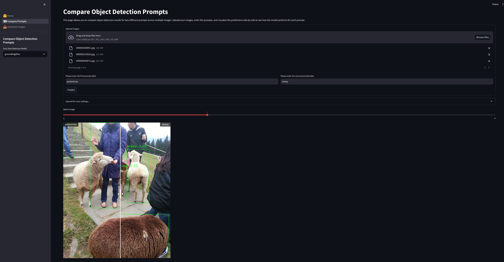

# Autodetectify

Welcome to **Autodetectify**, an advanced solution for for testing Zero-Shot(ZS) object detection models with different 
prompts and autolabelling datasets. This application provides a modern interface for comparing different object 
detection prompts on your uploaded images, auto-labeling images based on your specified prompt, and 
exporting the dataset in various formats.

## Features

- **Prompt Comparison**: Upload your images, enter different prompts, and visualize side-by-side comparisons of object detection results.
- **Auto-Labeling and Export**: Automatically label your images using a specified prompt and download the labeled dataset in YOLOv5, YOLOv8, or COCO format.

## How to Use

### Prompt Comparison

  

1. Navigate to the **Prompt Comparison** tab.
2. Upload your images.
3. Enter the prompts you want to compare.
4. View and compare the object detection results side by side.

### Auto-Label and Export

  

1. Navigate to the **Auto-Label and Export** tab.
2. Upload up to 50 images or a ZIP file containing images.
3. Enter the prompt for labeling.
4. Run the auto-labeling process.
5. Download the labeled dataset in the desired format.

## Installation

To run this application locally, follow these steps:

1. Clone the repository:
    ```bash
    git clone https://github.com/sefaburakokcu/autodetectify
    cd autodetectify
    ```

2. Install the required dependencies:
    ```bash
    pip install -r requirements.txt
    ```

3. Run the Streamlit app under ui:
    ```bash
    streamlit run 🤗_Home.py
    ```

## License

This project is licensed under the MIT License. See the [LICENSE](LICENSE) file for details.

## Acknowledgements

- [Streamlit](https://streamlit.io/)
- [streamlit-image-comparison](https://pypi.org/project/streamlit-image-comparison/)
- [transformers](https://huggingface.co/docs/transformers/index)
